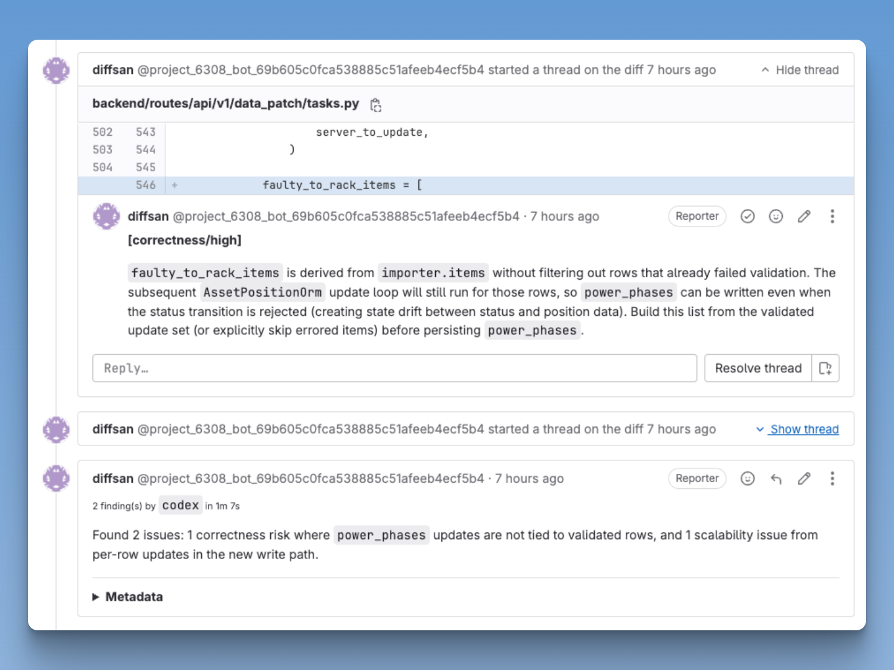
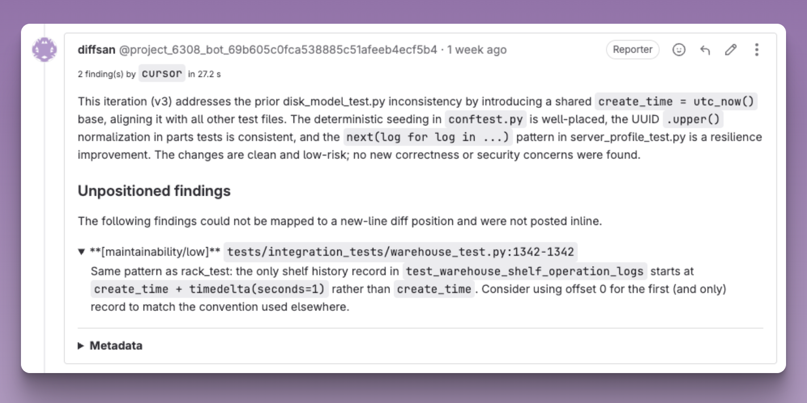

# diffsan

[](https://github.com/caika-lgtm/diffsan/actions/workflows/ci.yml)
[](https://codecov.io/gh/caika-lgtm/diffsan)
[](https://www.python.org/downloads/)
[](https://github.com/astral-sh/uv)
[](https://github.com/astral-sh/ruff)
[](https://github.com/astral-sh/ty)
[](https://github.com/caika-lgtm/diffsan/blob/main/LICENSE)

`diffsan` is an experimental Python CLI for AI-assisted code review in CI. It prepares GitLab merge request diffs, redacts secrets before prompting, runs a headless agent, validates strict JSON output, and posts a summary note plus inline discussions back to the MR.

<figure>
  
</figure>

<figure>
  
  <figcaption><code>diffsan</code> tracks prior reviews and can include findings on files not included in the MR diff</figcaption>
</figure>

## Features

- Reviews GitLab merge request diffs in CI
- Preprocesses diffs before prompting: ignore paths, prioritize code, truncate large diffs
- Redacts secrets-like content before sending prompts to the agent
- Supports both Cursor CLI and Codex CLI backends
- Validates review output against a strict schema before posting anything
- Uses a retry/repair loop for unstructured Cursor output
- Posts both a summary MR note and inline discussions when positions can be computed
- Tracks fingerprints and prior review digests to reduce repeated comments and spam
- Writes run artifacts and structured event logs for debugging, including failure cases

## Status

`diffsan` is currently **experimental**. The design is in place and the core pipeline is implemented, but interfaces, defaults, and docs should still be treated as moving targets while the project is being hardened.

## Requirements

- Python 3.11 or newer
- A git checkout with `git` available on `PATH`
- GitLab merge request pipeline context with the required CI variables available
- One supported agent CLI installed on the runner:
  - `cursor-agent`, or
  - `codex`
- GitLab API access via a token in the env var configured by `gitlab.token_env`
  (defaults to `GITLAB_TOKEN`)
- If you use the default Cursor command, `CURSOR_API_KEY` must be set unless your
  runner already has Cursor CLI auth configured

For GitLab CI runs, `diffsan` reads MR context from the environment. In practice,
the runner should provide at least:

- `CI_PROJECT_ID`
- `CI_MERGE_REQUEST_IID`
- `CI_MERGE_REQUEST_TARGET_BRANCH_NAME`
- `CI_COMMIT_SHA`

It also uses `CI_API_V4_URL` when present to derive the GitLab API base URL, and
can use `CI_MERGE_REQUEST_SOURCE_BRANCH_NAME` plus
`CI_MERGE_REQUEST_DIFF_BASE_SHA` when available.

## Quick Start

This guide assumes you are using GitLab, have at least the Maintainer role on the
project, and plan to use the `codex` agent backend.

1. Create a _Project Access Token_

   Generate a _Project Access Token_ under `Settings > Access Tokens` so that
   `diffsan` can post discussions and comments to your merge requests.
   - The token name you choose will also be the name of the bot account created
     to post comments.
   - Under scopes, grant at least the `api` scope.

2. Provide the token via CI/CD variables

   Add the token as a project CI/CD variable. GitLab documentation:
   <https://docs.gitlab.com/ci/variables/#for-a-project>

   Under `Settings > CI/CD > Variables > Add variable`:
   - `Key`: `GITLAB_TOKEN`
   - `Value`: the token generated in step 1
   - Make sure `Protect variable` is unchecked
   - Make sure `Mask variable` is checked so the token does not leak in logs

3. Authenticate the `codex` agent

   You need to set the `OPENAI_API_KEY` environment variable.

   You can use the same project CI/CD variable flow as in step 2:

   - `Key`: `OPENAI_API_KEY`
   - `Value`: your OpenAI API key

   Get your API key from the [OpenAI dashboard](https://platform.openai.com/api-keys).

4. Update `.gitlab-ci.yml`

   Append an `ai` stage at the end of `stages`, then add a job like this:

   ```yaml
   code-review:
     stage: ai
     cache: []
     needs: []
     image:
       name: node:20-bookworm
       pull_policy: if-not-present
     allow_failure: true
     timeout: 10 minutes
     before_script:
       - apt-get update
       - apt-get install -y --no-install-recommends ca-certificates git pipx python3 python3-venv
       - rm -rf /var/lib/apt/lists/*
       - npm i -g @openai/codex
       - codex --version
     script:
       - export PATH="$HOME/.local/bin:$PATH"
       - pipx run --spec "git+https://github.com/caika-lgtm/diffsan.git@main" diffsan --ci --agent codex
     artifacts:
       when: always
       paths:
         - .diffsan/
       expire_in: 1 week
     rules:
       - if: '$CI_PIPELINE_SOURCE == "merge_request_event"'
         when: on_success
   ```

5. Open a merge request and verify the job

   Create a merge request containing the updated `.gitlab-ci.yml`, let the MR
   pipeline run, and confirm that `diffsan` posts its summary note and inline
   discussions as expected.

   For configuration options and overrides, see:
   <https://caika-lgtm.github.io/diffsan/configuration/>

## Documentation

The public docs are hosted on GitHub Pages at <https://caika-lgtm.github.io/diffsan>.

## Repository Layout

- `src/diffsan/`: package source
- `src/diffsan/core/`: pipeline logic for config, diff prep, prompting, agents, parsing, formatting, and GitLab posting
- `src/diffsan/contracts/`: typed schemas, events, and error contracts
- `src/diffsan/io/`: artifact and logging helpers
- `tests/`: unit and pipeline-level tests
- `docs/`: user-facing documentation site
- `docs/design/`: canonical product, architecture, contract, and integration design docs

## Contributing

See [CONTRIBUTING.md](CONTRIBUTING.md) for development setup, code quality expectations, and pull request guidance.

## Support / Contact

- Bug reports and feature requests: <https://github.com/caika-lgtm/diffsan/issues>
- Documentation: <https://caika-lgtm.github.io/diffsan>
- Email: <mailto:caika@sea.com>

## License

This project is licensed under the Apache-2.0 License. See [LICENSE](LICENSE) for details.
